# GitHub MCP Server Dojo 🥋

A playground repository for experimenting with the [GitHub MCP Server](https://github.com/github/github-mcp-server) - exploring its powerful tools, testing workflows, and discovering creative automation possibilities.

## About

This repository serves as a testing ground and learning environment for the GitHub Model Context Protocol (MCP) Server. The GitHub MCP Server provides seamless integration with GitHub APIs, enabling advanced automation and interaction capabilities through AI tools.

## Architecture Overview

```mermaid
graph TB
    subgraph "Frontend Application"
        HTML[index.html<br/>Main Structure<br/>🌐 Website Layout] --> CSS[styles.css<br/>Dark Purple Theme<br/>🎨 Visual Styling]
        HTML --> JS[script.js<br/>Interactive Features<br/>⚡ DOM Manipulation]
        CSS --> VARS[CSS Variables<br/>🎯 Theme System<br/>Color Management]
        JS --> FEATURES[🔥 Features:<br/>• Smooth Scrolling<br/>• Animations<br/>• Copy Functionality<br/>• Progress Indicator]
    end
    
    subgraph "Development Toolchain"
        PKG[package.json<br/>📦 Dependencies & Scripts<br/>Project Configuration] --> ESLINT[ESLint<br/>📝 JavaScript Linting]
        PKG --> STYLELINT[Stylelint<br/>🎨 CSS Linting]
        PKG --> HTMLHINT[HTMLHint<br/>🌐 HTML Validation]
        PKG --> PRETTIER[Prettier<br/>✨ Code Formatting]
        HTMLHINTRC[.htmlhintrc<br/>⚙️ HTML Validation Rules] --> HTMLHINT
        PACKAGELOCK[package-lock.json<br/>🔒 Dependency Lock] --> PKG
    end
    
    subgraph "GitHub Integration"
        MCP_EXAMPLE[.vscode/mcp.json.example<br/>📋 MCP Server Template<br/>Safe Configuration] --> GITHUB_API[GitHub MCP Server<br/>🔗 Remote HTTP Endpoint<br/>api.githubcopilot.com]
        ENV_EXAMPLE[.env.example<br/>🔐 Environment Template<br/>Token Placeholder] --> LOCAL_SETUP[Local Development<br/>🛠️ Configuration Setup]
        CLAUDE_CONFIG[.claude/settings.local.json<br/>🤖 Claude MCP Settings<br/>Permissions & Servers]
    end
    
    subgraph "Documentation & Content"
        README[README.md<br/>📚 Project Overview<br/>Architecture Guide] --> DOCS[.docs/prompts.md<br/>📖 Usage Examples<br/>314+ Lines of Workflows]
        DOCS --> WORKFLOW_EXAMPLES[🎯 Workflow Categories:<br/>• Repository Management<br/>• Issue Automation<br/>• PR Workflows<br/>• CI/CD Integration<br/>• Security & Compliance<br/>• Team Collaboration]
    end
    
    subgraph "CI/CD Pipeline"
        DEPLOY_WF[.github/workflows/deploy.yml<br/>🚀 GitHub Pages Deploy<br/>Automated Deployment] --> PAGES[GitHub Pages<br/>🌍 Static Hosting<br/>Live Website]
        LINT_WF[.github/workflows/linter.yaml<br/>✅ PR Validation<br/>Code Quality Checks] --> QUALITY[Code Quality<br/>🔍 Automated Checks<br/>ESLint + Stylelint + HTMLHint]
        PKG --> DEPLOY_WF
        PKG --> LINT_WF
    end
    
    subgraph "Configuration & Security"
        GITIGNORE[.gitignore<br/>🛡️ Git Exclusions<br/>Security Protection] --> NODE_MODULES[node_modules/<br/>📚 Dev Dependencies<br/>Excluded from Git]
        GITIGNORE --> ENV_SECURITY[🔒 Protected Files:<br/>• .env<br/>• .vscode/mcp.json<br/>• *.local files]
    end
    
    subgraph "Runtime Interactions"
        BROWSER[🌐 Web Browser] --> HTML
        VSCODE[💻 VS Code] --> MCP_EXAMPLE
        GITHUB_API --> API_ENDPOINTS[GitHub REST API<br/>🔧 Toolsets:<br/>• repos • issues • pull_requests<br/>• actions • code_security<br/>• notifications • users<br/>• secret_protection • context]
        CLAUDE_CONFIG --> GITHUB_API
    end
    
    subgraph "Content Architecture"
        HTML --> HERO[🎯 Hero Section<br/>Project Introduction<br/>Call-to-Action Buttons]
        HTML --> TOOLSETS[🧰 Toolsets Grid<br/>8 MCP Toolsets<br/>Interactive Cards]
        HTML --> QUICKSTART[⚡ Quick Start<br/>Installation Options<br/>Remote & Local Setup]
        HTML --> EXAMPLES[📋 Examples Grid<br/>6 Workflow Categories<br/>Feature Showcase]
        DOCS --> ADVANCED_EXAMPLES[🚀 Advanced Features:<br/>• Cross-Repository Operations<br/>• Intelligent Automation<br/>• Security Workflows<br/>• Team Analytics]
    end
    
    %% File Flow Dependencies
    HTML -.->|references| CSS
    HTML -.->|references| JS
    CSS -.->|cache busting| VERSIONING[?v=2025-06-20]
    JS -.->|cache busting| VERSIONING
    
    %% Styling with enhanced colors
    classDef frontend fill:#9D7BFF,stroke:#C792EA,stroke-width:3px,color:#fff
    classDef toolchain fill:#4ADE80,stroke:#22C55E,stroke-width:3px,color:#000
    classDef github fill:#60A5FA,stroke:#3B82F6,stroke-width:3px,color:#fff
    classDef docs fill:#C792EA,stroke:#9D7BFF,stroke-width:3px,color:#fff
    classDef cicd fill:#F59E0B,stroke:#D97706,stroke-width:3px,color:#000
    classDef config fill:#6B7280,stroke:#4B5563,stroke-width:3px,color:#fff
    classDef runtime fill:#EF4444,stroke:#DC2626,stroke-width:3px,color:#fff
    classDef content fill:#10B981,stroke:#059669,stroke-width:3px,color:#fff
    
    class HTML,CSS,JS,VARS,FEATURES,VERSIONING frontend
    class PKG,ESLINT,STYLELINT,HTMLHINT,PRETTIER,HTMLHINTRC,PACKAGELOCK toolchain
    class MCP_EXAMPLE,GITHUB_API,ENV_EXAMPLE,LOCAL_SETUP,CLAUDE_CONFIG,API_ENDPOINTS github
    class README,DOCS,WORKFLOW_EXAMPLES,ADVANCED_EXAMPLES docs
    class DEPLOY_WF,LINT_WF,PAGES,QUALITY cicd
    class GITIGNORE,NODE_MODULES,ENV_SECURITY config
    class BROWSER,VSCODE runtime
    class HERO,TOOLSETS,QUICKSTART,EXAMPLES content
```



## What's Inside

- **`.docs/prompts.md`** - Comprehensive collection of example prompts and workflows showcasing the full capabilities of the GitHub MCP Server
- **Experimental playground** - Space for testing various GitHub MCP Server features and toolsets
- **Workflow examples** - Real-world automation scenarios and use cases

## GitHub MCP Server Overview

The GitHub MCP Server offers several powerful toolsets:

| Toolset | Description |
|---------|-------------|
| **repos** | Repository operations (files, branches, commits) |
| **issues** | Issue management and tracking |
| **pull_requests** | PR creation, reviews, and management |
| **actions** | GitHub Actions workflows and CI/CD |
| **code_security** | Code scanning and security alerts |
| **notifications** | GitHub notifications management |
| **users** | User and account operations |
| **secret_protection** | Secret scanning and protection |
| **context** | Current user and GitHub context |
| **experiments** | Experimental features |

## Quick Start

### Remote Server (Easiest)

[](https://insiders.vscode.dev/redirect/mcp/install?name=github&config=%7B%22type%22%3A%20%22http%22%2C%22url%22%3A%20%22https%3A%2F%2Fapi.githubcopilot.com%2Fmcp%2F%22%7D) [](https://insiders.vscode.dev/redirect/mcp/install?name=github&config=%7B%22type%22%3A%20%22http%22%2C%22url%22%3A%20%22https%3A%2F%2Fapi.githubcopilot.com%2Fmcp%2F%22%7D&quality=insiders)

The remote GitHub MCP Server is hosted by GitHub and provides the easiest setup method:

1. **VS Code**: Use the one-click install button from the [official repo](https://github.com/github/github-mcp-server)
2. **Manual configuration**: Add to your MCP settings:
   ```json
   {
     "servers": {
       "github": {
         "type": "http",
         "url": "https://api.githubcopilot.com/mcp/"
       }
     }
   }
   ```

### Local Server (Docker)

For local development or custom configurations:

```bash
docker run -i --rm \
  -e GITHUB_PERSONAL_ACCESS_TOKEN=<your-token> \
  ghcr.io/github/github-mcp-server
```

## Example Workflows

Check out [`.docs/prompts.md`](.docs/prompts.md) for detailed examples including:

- **Repository Management** - File operations, branch management, bulk operations
- **Issue Automation** - Smart triage, analytics, batch operations
- **PR Workflows** - Automated reviews, merge management, analytics
- **CI/CD Integration** - Workflow monitoring, failure analysis, deployment automation
- **Security & Compliance** - Code scanning, secret detection, security reporting
- **Team Collaboration** - Notification management, user analytics, cross-repo operations

## Getting Started

1. **Set up the GitHub MCP Server** following the [official documentation](https://github.com/github/github-mcp-server)
2. **Explore the examples** in [`.docs/prompts.md`](.docs/prompts.md)
3. **Start experimenting** with your own workflows and automations
4. **Share your discoveries** - contributions welcome!

## Configuration Tips

- **Use specific toolsets**: Enable only what you need with `--toolsets` for better performance
- **Start with read-only**: Use `--read-only` flag for safe exploration
- **Enable context toolset**: Always include `context` for better AI understanding
- **Try experiments**: Enable `experiments` toolset for cutting-edge features

## Resources

- [GitHub MCP Server Official Repository](https://github.com/github/github-mcp-server)
- [Model Context Protocol Documentation](https://modelcontextprotocol.io/introduction)
- [GitHub API Documentation](https://docs.github.com/en/rest)
- [VS Code MCP Integration](https://code.visualstudio.com/docs/copilot/chat/mcp-servers)

## License

This project is licensed under the MIT License - see the 
[GitHub MCP Server license](https://github.com/github/github-mcp-server/blob/main/LICENSE) for details.

---

🚀 **Ready to explore?** Start with the examples in [`.docs/prompts.md`](.docs/prompts.md) 
and unleash the power of GitHub automation!
